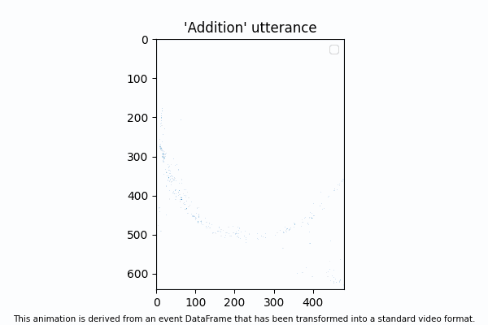

# &nbsp;&nbsp;&nbsp;&nbsp;&nbsp;&nbsp;&nbsp;&nbsp;&nbsp;&nbsp;&nbsp;&nbsp;&nbsp;&nbsp;&nbsp;&nbsp;&nbsp;&nbsp;&nbsp;&nbsp;&nbsp;&nbsp;&nbsp;&nbsp;&nbsp;&nbsp;&nbsp;&nbsp;&nbsp;&nbsp;&nbsp;&nbsp;&nbsp;&nbsp;&nbsp; Event Data Classification

<br>

This GitHub repository showcases an academic project that focuses on classifying event data obtained from an event-based sensor - [Event Camera], also known as a neuromorphic sensor. The event data, provided by [Prophesee](https://www.prophesee.ai), holds valuable insights that can be utilized across various domains.

[Event Camera]: https://en.wikipedia.org/wiki/Event_camera

Please note that the data used for this project will not be published in this repository due to ownership rights. However, the same dataset can be accessed and downloaded by anyone interested from the following Kaggle link: [Kaggle Dataset](https://www.kaggle.com/competitions/smemi309-final-evaluation-challenge-2022/data).

<br>

## Introduction

An event is a $4$-tupe $(x,y,p,t)$ where

- $(x,y)$ denotes the pixel's position associated with the event.
- $p$ is a boolen indicating wether the change in luminosity is increasing or decreasing.
- $t$ represents the timestamp (in $\mu s$) from the start of the recording.

Event Data are DataFrames, with each row representing an event, sorted in ascending order *w.r.t.* the timestamp.

Here is an illustration of the said data type, transformed into a format akin to video data:

<p align="center">
  
</p>

<br>

## Usage

To use this project, follow these steps:

1. **Clone the repository**: First, clone this repository to your local machine using

    ```bash
    git clone https://github.com/adlyZaroui/Event-camera-classification.git
    ```

2. **Download the dataset**: You can download the dataset from [this Kaggle link](https://www.kaggle.com/competitions/smemi309-final-evaluation-challenge-2022/data).
Search for the `train10` folder and download it. Once downloaded, position it in the root directory of your local repository.
This folder houses another folder also titled `train10`, which in turn contains 10 subfolders. Ultimately, it should appear as follows:

    ```bash
    local_repo/
    ├──── train10/
    │       ├── train10/
    │             ├── Addition/
    │             ├── Carnaval/
    │             ├── Decider/
    │             ├── Ecole/
    │             ├── Fillette/
    │             ├── Huitre/
    │             ├── Joyeux/
    │             ├── Musique/
    │             ├── Pyjama/
    │             └── Ruisseau/
    ├──── .venv/
    ├──── .gitignore
    ├──── .LICENSE
    ├──── ...
    └──── *.ipynb

    ```

Every folder within `train10/train10/` holds 32 csv files, named from `0.csv` to `31.csv`. These files represent event data focused on the face of a speaker uttering a specific word, which is also the name of the parent folder. For instance, the folder `train10/train10/Musique` contains 32 csv files, each capturing event data of someone pronouncing the French word *Musique*.

Further details about the methodology employed to record this dataset can be found at the provided [Kaggle Competition link](https://www.kaggle.com/competitions/smemi309-final-evaluation-challenge-2022/data).

3. **Install dependencies**: This project requires certain Python libraries. You can install them using pip:

    ```bash
    pip install -r requirements.txt
    ```

4. **Virtual Environment**: You can now enable the virtual environment by typing
    
    ```bash
    source .venv/bin/activate
    ```

5. **Notebook**: You can now execute the Notebook `temporary.ipynb` in Jupyter or watherver notebook server you prefer (vscode, google colab, ...)

<br>

## Overall

The project starts with preprocessing the raw event data by converting it into pixel matrices, leveraging the inherent structure and characteristics of the data. This conversion enables the utilization of conventional image processing methods.

To handle high-dimensional data effectively, dimensionality reduction is employed using Principal Component Analysis (PCA). By reducing the dimensionality of the data while preserving relevant information, PCA allows for efficient computation and improved model performance.

The next step involves comparing the performance of a Random Forest classifier on the raw data versus the reduced data. Random Forest is a powerful ensemble learning algorithm known for its ability to handle high-dimensional data and deliver robust results. By evaluating the model performance on both versions of the data, valuable insights are gained regarding the impact of dimensionality reduction on classification accuracy.

Building upon these findings, a Bagging Random Forest classifier is constructed using the reduced data. Bagging enhances the predictive power of Random Forest by aggregating multiple decision trees trained on bootstrap samples of the dataset. This ensemble approach increases model stability, generalization, and overall classification accuracy.

Throughout this project, code samples, data preprocessing techniques, dimensionality reduction methods, model training, and evaluation procedures are provided, allowing researchers, data scientists, and machine learning enthusiasts to replicate the experiments and gain deeper insights into event data classification.

The repository also includes a detailed documentation, explaining the project's objectives, methodology, and results, along with relevant visualizations and performance metrics. By leveraging the power of Random Forest and dimensionality reduction techniques, this project offers valuable knowledge and resources for tackling event data classification challenges.

The Kaggle Challenge is available in the following link https://www.kaggle.com/competitions/smemi309-final-evaluation-challenge-2022

<br>

## Contributing:
Contributions to this project are highly encouraged and welcome. If you are interested in further enhancing the capabilities of event data classification, there are several areas where you can make valuable contributions. One possible area of contribution is to consider the raw data as time series and handle the problem as a multivariate time series classification.

<br>

## License

This project is open source, under the terms of the [MIT License](https://opensource.org/licenses/MIT).
